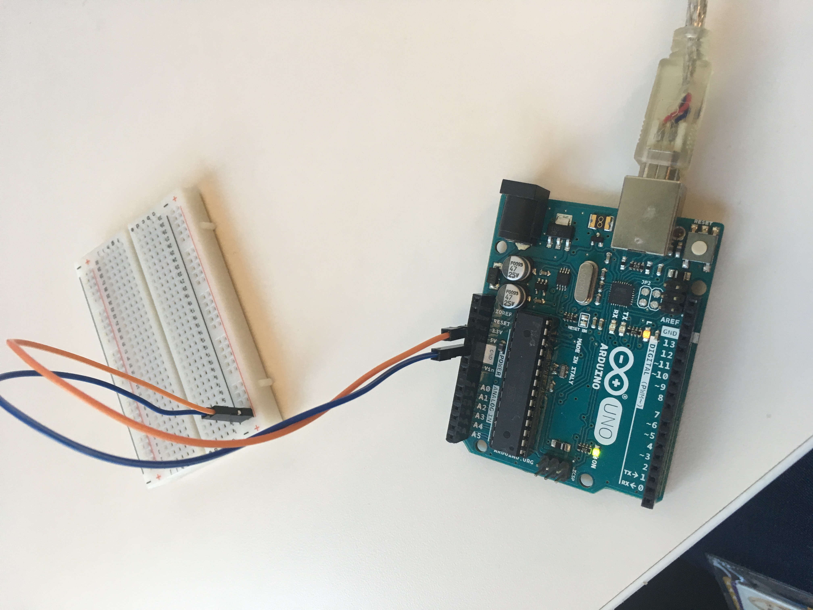

# IDD-Fa18-Lab1: Blink!

**A lab report by Natalie Friedman**

> Include your responses to the bold questions on your own fork of the lab activities. Include snippets of code that explain what you did. Deliverables are due next Tuesday. Post your lab reports as `README.md` pages on your GitHub, and post a link to that on your main class hub page.

## Part A. Set Up a Breadboard

## Part B. Manually Blink a LED\

**a. What color stripes are on a 100 Ohm resistor?**
 brown, black, black
 
**b. What do you have to do to light your LED?**
Press the button, after:
Put the LED into the breadboard, put resistor in same number row, Remember to flip LED so long side is matched, wire negative to resistor, wire LED to positive and connect negative to 5v and positive to ground. 

## Part C. Blink a LED using Arduino

### 1. Blink the on-board LED

**a. What line(s) of code do you need to change to make the LED blink (like, at all)?**
No changes woohoo

**b. What line(s) of code do you need to change to change the rate of blinking?**
Delay.

**c. What circuit element would you want to add to protect the board and external LED?**
A resistor.
 
**d. At what delay can you no longer *perceive* the LED blinking? How can you prove to yourself that it is, in fact, still blinking?**

No floats allowed. Instead you can use delayMicroseconds(1) to make it inpercievable. You can look at the code or take a really high frame rate photo. 

**e. Modify the code to make your LED blink your way. Save your new blink code to your lab 1 repository, with a link on the README.md.**

### 2. Blink your LED

**Make a video of your LED blinking, and add it to your lab submission.**

## Part D. Manually fade an LED

**a. Are you able to get the LED to glow the whole turning range of the potentiometer? Why or why not?**

Yes, I am. I can because the resistor is not in the breadboard. If the resistor was still in I would not be able to see the full range. 

## Part E. Fade an LED using Arduino

**a. What do you have to modify to make the code control the circuit you've built on your breadboard?**

You need to change the pin number physically, and in the code. 
Justin, I don't remember what we changed?

**b. What is analogWrite()? How is that different than digitalWrite()?**

Analog is a continuous range(0-1024) and digital is discrete (yes/no).
When you dim the light in analog (continous), the light is using a resistor.
When you dim the light in digital (discrete), the light is turning all the way on and off very fast or very slow. 

digitalWrite will set the specified pin to one of two states - HIGH/LOW, which equate to 5v (3.3v on some boards) and ground respectively.

analogWrite can vary by the type of output used.
https://arduino.stackexchange.com/questions/35873/whats-the-difference-between-analogwrite-and-digitalwrite/36029

## Part F. FRANKENLIGHT!!!

### 1. Take apart your electronic device, and draw a schematic of what is inside. 

**a. Is there computation in your device? Where is it? What do you think is happening inside the "computer?"**

**b. Are there sensors on your device? How do they work? How is the sensed information conveyed to other portions of the device?**

**c. How is the device powered? Is there any transformation or regulation of the power? How is that done? What voltages are used throughout the system?**

**d. Is information stored in your device? Where? How?**

### 2. Using your schematic, figure out where a good point would be to hijack your device and implant an LED.

**Describe what you did here.**

### 3. Build your light!

**Make a video showing off your Frankenlight.**

**Include any schematics or photos in your lab write-up.**

When switching computers, make sure you select the right board by going tools, port, select arduino
